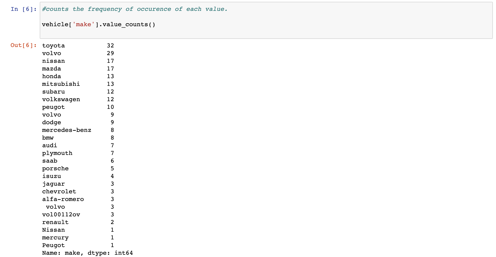
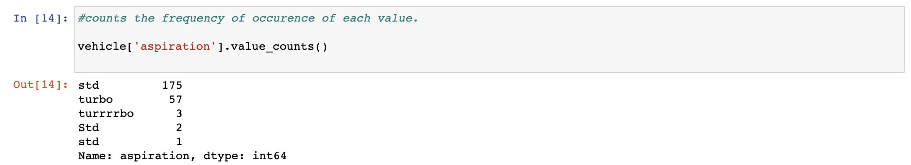
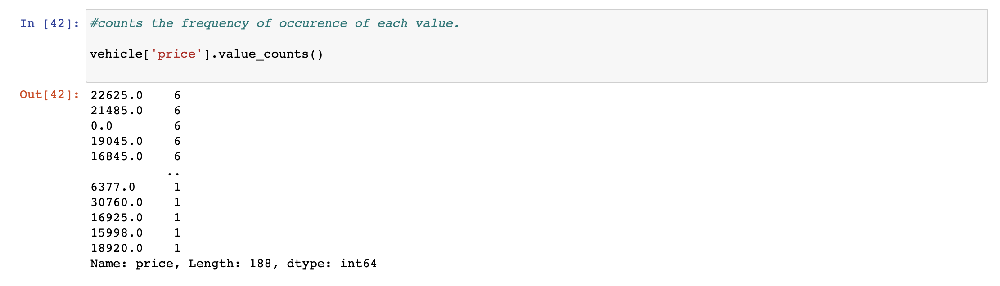
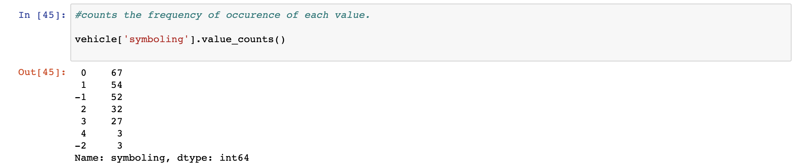
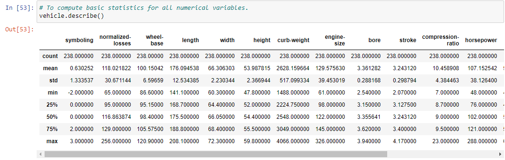
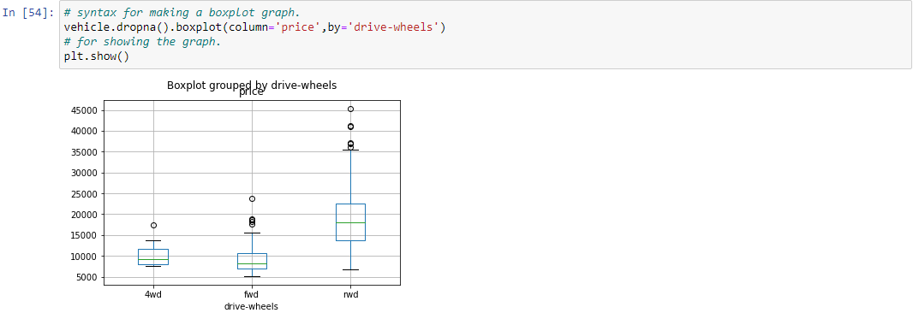
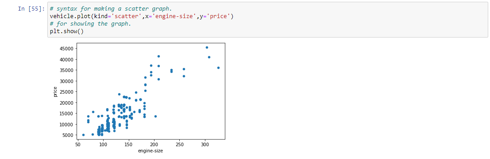
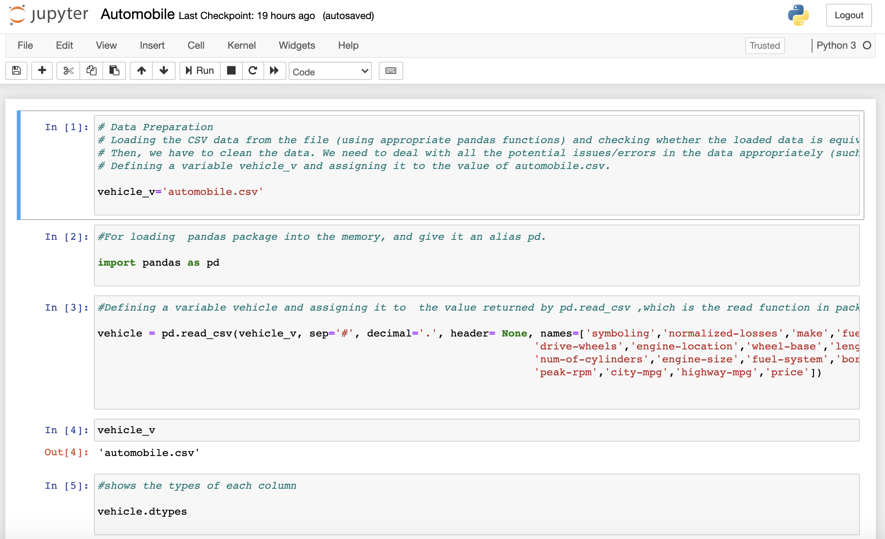

# Data Cleaning and Exploration Project.

# Index:
This repository holds data cleaning and exploration project.
1. [Images](https://github.com/Justin-Mathew/Data-Cleaning-and-Exploration-Project/tree/main/Images) Images used in readme file.
2. [Automobile.csv](https://github.com/Justin-Mathew/Data-Cleaning-and-Exploration-Project/blob/main/Automobile.csv) CSV file used for this project.
3. [Automobile.ipynb](https://github.com/Justin-Mathew/Data-Cleaning-and-Exploration-Project/blob/main/Automobile.ipynb) Python code.
4. [AutomobileDetails.txt](https://github.com/Justin-Mathew/Data-Cleaning-and-Exploration-Project/blob/main/AutomobileDetails.txt) Columns present in CSV file.

# Objective:

The objective is to clean the dataset by dealing with incorrect, missing, duplicate & inconsistent values using python pandas and performing exploratory data analysis to gain useful insights of the data set.

# About the dataset:

The data set that we are using is Automobile which can be downloaded from the link:
https://www.kaggle.com/toramky/automobile-dataset

This data set has 26 different columns. These consists of three types of entities:
1.	Specifications of the automobile.
2.	Insurance risk rating. The range is between-3 (pretty safe) to +3 (risky).
3.	Normalised losses. The range is between 65 to 256. This entity represents average loss per car per year.

# Data cleaning:

Data cleaning is the process of removing inconsistent and wrongly formatted data. This can be achieved by manually dealing with these values or by automating the process.

Having a clean dataset will boost the overall productivity by making better decisions and hypothesis relating to a data set.

## Steps taken to clean the dataset:

By counting the frequency of occurrence of each value we observe that values are inconsistent. Dealing with these inconsistent values by removing white spaces and replacing some of the values.

### Checking all values in make column:

•	Removing all white spaces using strip command.
•	Replacing vol00112ov to volvo.
•	Replacing Nissan to nissan.
•	Replacing Peugot to peugot.

### Checking all the values in fuel-type:

 
•	Removing all white spaces using strip command.
•	Replacing Gas to gas.
•	Replacing Diesel to diesel.

### Checking all the values in aspiration column:

 
 
•	Removing all white spaces using the strip command.
•	Replacing turrrrbo to turbo.
•	Replacing Std to std.

### Checking all the values in number of doors column:

 
 

•	Removing all white spaces using strip command.
•	Replacing fourR to four.
•	Replacing fourR to four.

### Checking all the values in body style column:

 

•	Removing all white spaces using strip command.
•	Replacing Sedan to sedan.
•	Replacing Wagon to wagon.

### Checking all the values in drive wheels column:

 

•	Removing all white spaces using strip command.
•	Replacing Fwd to fwd.

### Checking all the values in engine location column:

 
•	Removing all white spaces using strip command.
•	Replacing Front to front.
•	Replacing FRONT to front.
•	Replacing REAR to rear.
•	Replacing Rear to rear.

### Checking all the values in fuel system column:
 

•	Removing all white spaces using strip command.
•	Replacing Mpfi to mpfi.

### Checking the number of nulls in all the columns:

 
•	Replacing all the numerical null values with mean values.
•	Replacing all the categorical null values with suitable values in the column.

### Checking all the values in price column:
 
•	Replacing 0.000000 with mean value.

### Checking all the values in symbolling column:
 

•	Replacing the value 4 which is out of range with 3.

### Checking normalized losses column to verify if the values are between 65 and 256:

 
•	Replacing the values that are out of range with the mean values in the same column.

### Checking if all the values are in appropriate range:

 

### Generating csv file:
•	Finally generating a new csv file with clean data.

# Exploratory Data Analysis:

The purpose of performing exploratory data analysis is to gain better understanding of the data set by identifying the correlation between different variables and summarizing the key features of the dataset.
The price column in the automobile dataset is a target values that means we would like to predict the price of the cars with the help of different variables present in the dataset.

## Data Distribution:
To get a quick overview of the distribution of the data

## Boxplot:
Finding relationship between price and drive wheels variable. From the visualization we can observe that rear wheel drive cars are expensive as compared to front and four-wheel drive cars.

Advantages of using boxplot:
1.	Boxplots are great for representing median values (represented by a line between the rectangle).
2.	It also highlights the outliers that are present in the dataset represented by dots that are present outside the upper and lower extremes.

## Scatterplot:
Scatterplot is also a great way to visualize the relationship between two variables. In scatterplot each observation is represented as a dot.

From the visualization we can observe there is a positive relationship between engine size and price of the car.

## Pearson correlation:
To find correlation between all the variable in the data set

1. +1 represents total positive linear correlation.
2.  0 represents no correlation.
3. -1 represents total negative linear correlation.

# Conclusion:

1. The dataset was cleaned by replacing all the missing numerical data with mean values and missing categorical data with suitable values. The inconsistent values were replaced by suitable values making the dataset consistent. The out of range values was also replaced by mean values.

2. Performing exploratory data analysis will help us to determine useful variables that affects our target values. We can further use these variables to feed in a machine learning model that predicts the price of the cars that will help in improving the performance of the model.

# How to run python code:

1.	Download anaconda navigator from the link: https://www.anaconda.com/products/individual
2.	Launch jupyter notebook.

 
3.	Download Automobile.ipynb file and automobile.csv file. Both the files should be present in the same folder. 

4.	Open Automobile.ipynb file using jupyter notebook.
5.	Run to generate new csv file with clean data.

 

# Contact me:
| Contact Method | Links  |
| --- | --- |
| Email | justinmathew.cta@gmail.com |
| LinkedIn | www.linkedin.com/in/thejustinmathew |

 
